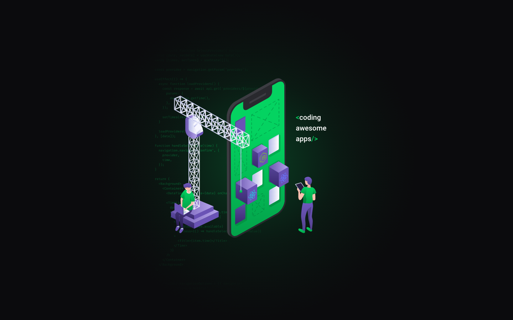

# devradar :rocket: 
Projeto resultado da Semana Omnistack #11

## Ferramentas utilizadas :hammer: :wrench: :triangular_ruler:

- [PostMan](https://www.getpostman.com/) - Utilizado para testar as chamadas da API.
- SQLite3 -  Utilizado para Banco de dados
- [Node.js](https://nodejs.org/) v4+.
- [Yarn](https://yarnpkg.com/lang/en/) para baixar os pacotes necessários.
- [VsCode](https://code.visualstudio.com/) para codar :heart:

## Projetos :bulb:
- [x] Backend
- [ ] Frontend
- [ ] Mobile

#### - Creditos para semana Omnistack #11 por [Rocketseat](https://rocketseat.com.br/)
#### - Creditos para [Diego](https://github.com/diego3g) por dividir tanto conhecimento.
#### - Creditos para [Felipe Deschamps](https://github.com/filipedeschamps) por ter me apresentado o Diego.
